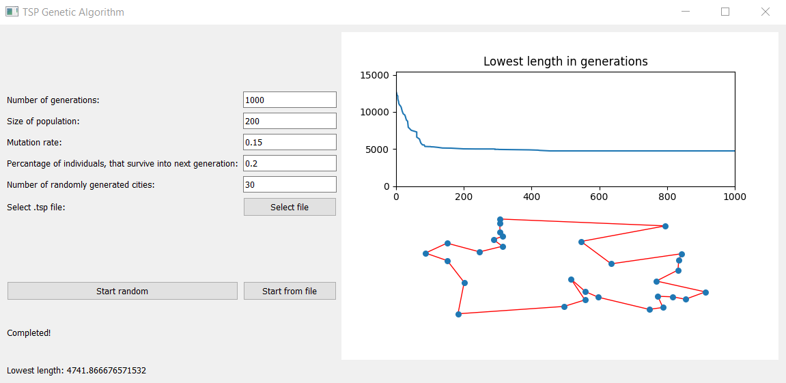

# GA_TSP (Simple genetic algorithm for TSP)
### Course Artificial Intelligence Algorithms

**Description:** The [course](https://www.fme.vutbr.cz/en/studenti/predmety/261132) introduces basic approaches to artificial intelligence algorithms and classical methods used in the field. Main emphasis is given to automated formulas proves, knowledge representation and problem solving. Practical use of the methods is demonstrated on solving simple engineering problems.

### Project Description
Semestral project. Simple **Genetic Algoritm** for **Travelling Salesman Problem (TSP)**. User is allowed to change parameters via GUI. The application solves either random generated graphs or TSPLIB file formats (.tsp).

<figure>
    
    <figcaption>GUI</figcaption>
</figure>